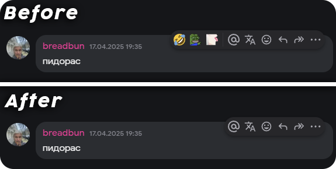
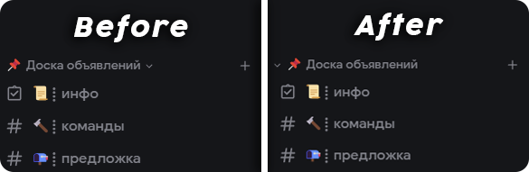

> [!NOTE]
> A part of my [Discord Vencord Config](https://rdf1337.xyz/discord-vencord) for importing custom css into [Vencord](https://vencord.dev/).

## Red mic-mute icon
**Preview:**


**Code:**

```css
@import url("https://raw.githubusercontent.com/RDF1337/DiscordSnippets/refs/heads/main/RedMuteMicIcon/main.css");
```
## Right panel role line
**Preview:**


**Code:**

```css
@import url("https://raw.githubusercontent.com/RDF1337/DiscordSnippets/refs/heads/main/RightPanelRoleLine/main.css");
```
## Clear client title
**Code:**

```css
@import url("https://raw.githubusercontent.com/RDF1337/DiscordSnippets/refs/heads/main/ClientTitle/main.css");
```
## Read all button animation
**Code:**

```css
@import url("https://raw.githubusercontent.com/RDF1337/DiscordSnippets/refs/heads/main/ReadAllBtnAnimation/main.css");
```
## Disable discovery button
**Preview:**


**Code:**

```css
@import url("https://raw.githubusercontent.com/RDF1337/DiscordSnippets/refs/heads/main/DisableDiscoveryBtn/main.css");
```
## TinyStatusArea
**Preview:**


**Code:**

```css
@import url("https://raw.githubusercontent.com/RDF1337/DiscordSnippets/refs/heads/main/TinyStatusArea/main.css");
```
## DisableActivity
**Preview:**


**Code:**

```css
@import url("https://raw.githubusercontent.com/RDF1337/DiscordSnippets/refs/heads/main/DisableActivity/main.css");
```
## RemoveQuickReactBar
**Preview:**



**Code:**

```css
@import url("https://raw.githubusercontent.com/RDF1337/DiscordSnippets/refs/heads/main/RemoveQuickReactBar/main.css");
```
## CollapseIconPositionFix
**Preview:**



**Code:**

```css
@import url("https://raw.githubusercontent.com/RDF1337/DiscordSnippets/refs/heads/main/CollapseIconPositionFix/main.css");
```
## RemoveProfileReactions
**Code:**

```css
@import url("https://raw.githubusercontent.com/RDF1337/DiscordSnippets/refs/heads/main/RemoveProfileReactions/main.css");
```
## CapchaInvertedColors
**Preview:**


**Code:**

```css
@import url("https://raw.githubusercontent.com/RDF1337/DiscordSnippets/refs/heads/main/CapchaInvertedColors/main.css");
```
