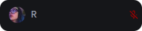
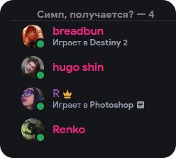
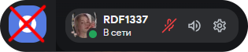
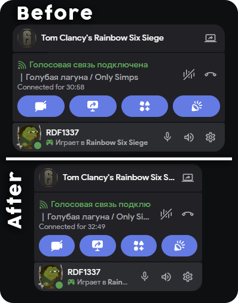
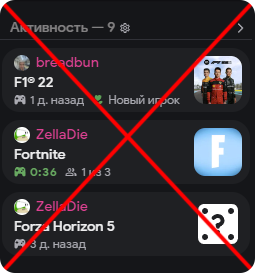
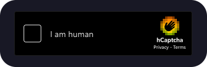
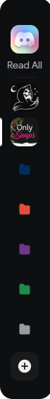

> [!NOTE]
> A part of my [Discord Vencord Config](https://rdf1337.xyz/discord-vencord) for importing custom css into [Vencord](https://vencord.dev/).

## Red mic-mute icon
**Preview:**



**Code:**

```css
@import url("https://rdf1337.github.io/DiscordSnippets/RedMuteMicIcon/main.css");
```
## Right panel role line
**Preview:**



**Code:**

```css
@import url("https://rdf1337.github.io/DiscordSnippets/RightPanelRoleLine/main.css");
```
## Clear client title
**Code:**

```css
@import url("https://rdf1337.github.io/DiscordSnippets/ClientTitle/main.css");
```
## Read all button animation
**Code:**

```css
@import url("https://rdf1337.github.io/DiscordSnippets/ReadAllBtnAnimation/main.css");
```
## Disable discovery button
**Preview:**



**Code:**

```css
@import url("https://rdf1337.github.io/DiscordSnippets/DisableDiscoveryBtn/main.css");
```
## TinyStatusArea
**Preview:**



**Code:**

```css
@import url("https://rdf1337.github.io/DiscordSnippets/TinyStatusArea/main.css");
```
## DisableActivity
**Preview:**



**Code:**

```css
@import url("https://rdf1337.github.io/DiscordSnippets/DisableActivity/main.css");
```
## RemoveQuickReactBar
**Preview:**


**Code:**

```css
@import url("https://rdf1337.github.io/DiscordSnippets/RemoveQuickReactBar/main.css");
```
## CollapseIconPositionFix
**Preview:**


**Code:**

```css
@import url("https://rdf1337.github.io/DiscordSnippets/CollapseIconPositionFix/main.css");
```
## RemoveProfileReactions
**Code:**

```css
@import url("https://rdf1337.github.io/DiscordSnippets/RemoveProfileReactions/main.css");
```
## CapchaInvertedColors
**Preview:**



**Code:**

```css
@import url("https://rdf1337.github.io/DiscordSnippets/CapchaInvertedColors/main.css");
```

## RoundedSquaresInServerList
**Preview:**



**Code:**

```css
@import url("https://rdf1337.github.io/DiscordSnippets/RoundedSquaresInServerList/main.css");
```
